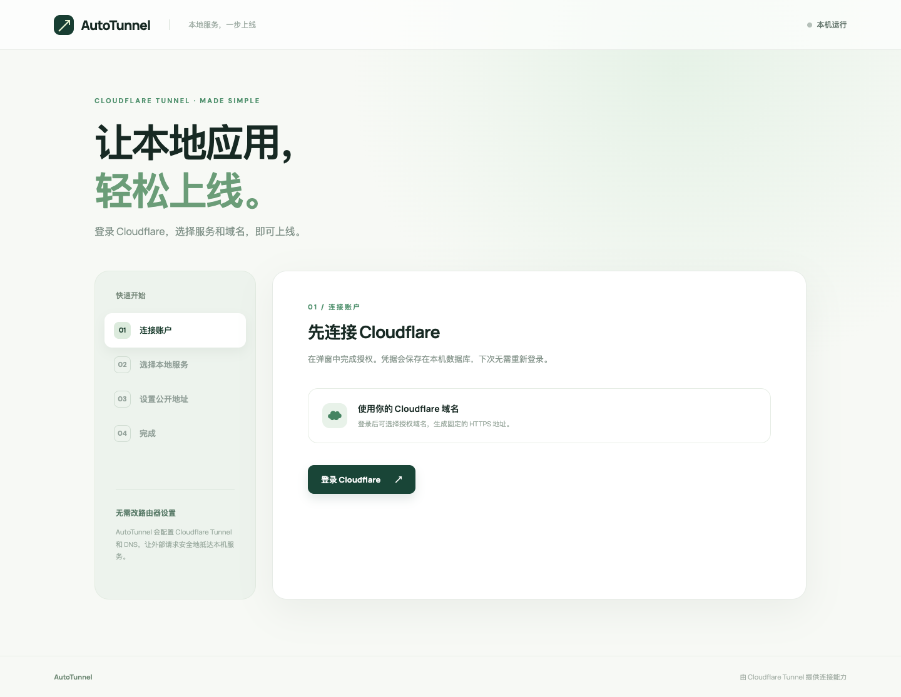
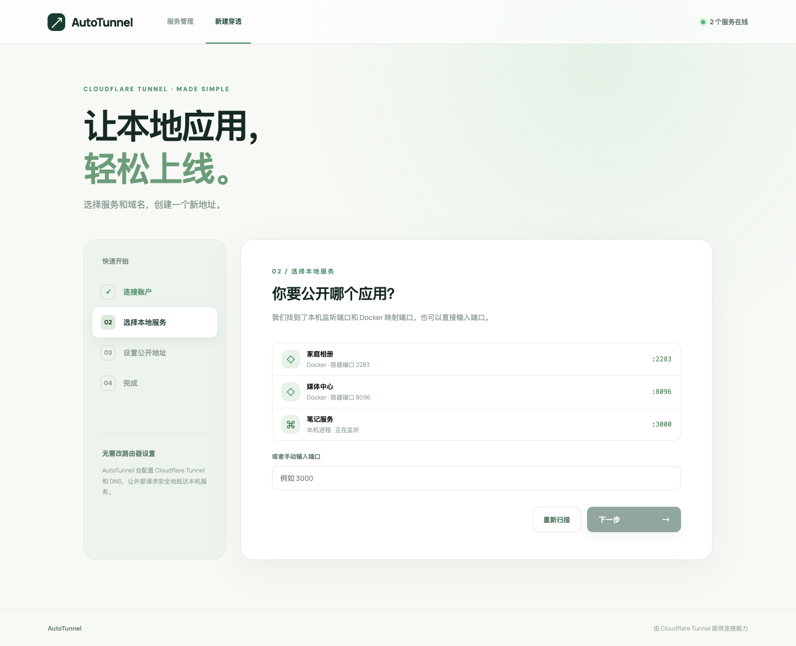
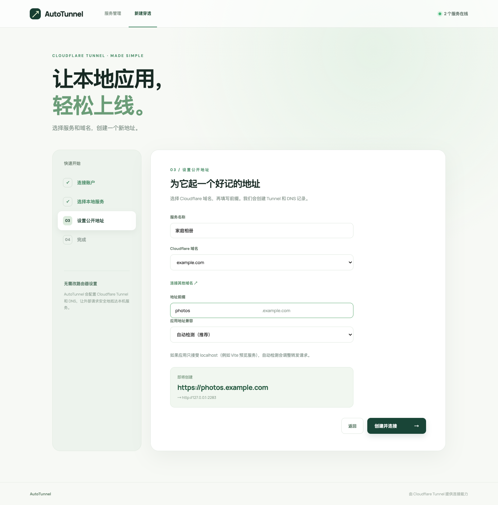
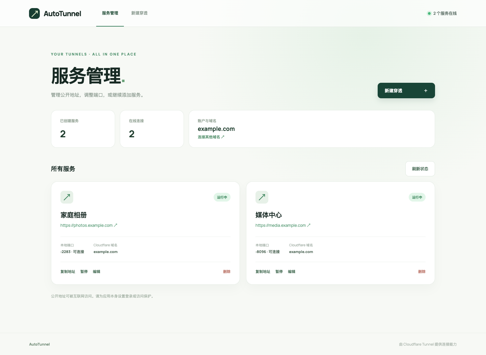

# AutoTunnel

**登录 Cloudflare，选一个本地服务，再填域名前缀。几步就能得到自己的 HTTPS 地址。**

适合把 NAS 上的相册、媒体中心、笔记等服务分享给自己或朋友。AutoTunnel 会创建 Cloudflare Tunnel 和 DNS 记录；以后还能在服务管理里改地址、换端口、暂停或继续连接。

## 复制这段 Compose，直接部署

无需下载本项目代码。把下面内容保存为 `compose.yaml`，在 Linux NAS 上的同一目录执行 `docker compose up -d`：

```yaml
services:
  autotunnel:
    image: ghcr.io/kongmei-ovo/autotunnel:latest
    container_name: autotunnel
    restart: unless-stopped
    network_mode: host
    pid: host
    user: "0"
    cap_add:
      - SYS_PTRACE
    security_opt:
      - apparmor:unconfined
    environment:
      AUTOTUNNEL_DATA_DIR: /data
    entrypoint: ["python", "-m", "backend.entrypoint"]
    command: ["uvicorn", "backend.app:app", "--host", "0.0.0.0", "--port", "18770"]
    volumes:
      - autotunnel-data:/data
      - /var/run/docker.sock:/var/run/docker.sock:ro

volumes:
  autotunnel-data:
```

默认管理页面监听 NAS 的 `0.0.0.0:18770`，在局域网电脑上打开 **http://NAS地址:18770**。请勿将管理端口直接暴露到公网。域名需要已接入 Cloudflare；首次登录时会自动准备 `cloudflared`。

这份 Compose 会在同一个容器中显示 Docker 容器名和 NAS 上的 Linux 进程名。读取宿主机进程需要 root、共享 PID、`SYS_PTRACE` 和放宽 AppArmor 限制；Docker socket 即使只读挂载也具有控制 Docker 的能力，因此请仅在可信的 NAS 上运行。端口的“常见用途”只作提示，不代表已验证应用类型。

每次向 `main` 提交代码，GitHub Actions 都会测试并发布 `linux/amd64`、`linux/arm64` 镜像到 GHCR。更新时执行 `docker compose pull && docker compose up -d`。

## 看看用起来是什么样

下图均使用 `example.com` 演示数据，没有展示真实账号或域名。

**第一次打开：登录 Cloudflare，按引导操作。**



**发现本地服务：选 Docker 映射端口或手动输入。**



**设置地址：选域名、填前缀，马上看到预览。**



**服务管理：之后再来，直接管理已有连接。**



<details>
<summary>更多部署与数据说明</summary>

- Compose 使用 Linux host 网络，因此可连接 NAS 本机的 `127.0.0.1:<端口>`。Docker 应用需将 TCP 端口映射到 NAS 宿主机。管理端口默认可从局域网访问；若经 NAS 反向代理访问，请给代理设置身份验证。
- 登录和 Tunnel 凭据保存在 `autotunnel-data` 卷内的 SQLite 数据库。重建容器不会清除它；请保护卷及其备份。已启用的穿透会在重启后恢复。
- 从 Mac 迁移时，先停止 Mac 端，再将 `~/.autotunnel/autotunnel.sqlite3` 复制到 NAS 的数据卷。不要让同一个 Tunnel 的两个实例长期同时运行。
- Vite 等应用可能拒绝公开域名的 Host。AutoTunnel 会自动检测并调整；也可以在新建或编辑服务时手动选择 Host 处理方式。
- 要在 Mac 上从源码运行：安装 Python 3.10+ 和 Node.js 20+，执行 `python3 -m venv .venv && .venv/bin/pip install -r requirements.txt`，再在 `frontend` 目录执行 `npm ci && npm run build`，最后从项目根目录运行 `.venv/bin/uvicorn backend.app:app --host 127.0.0.1 --port 18770`。

</details>
